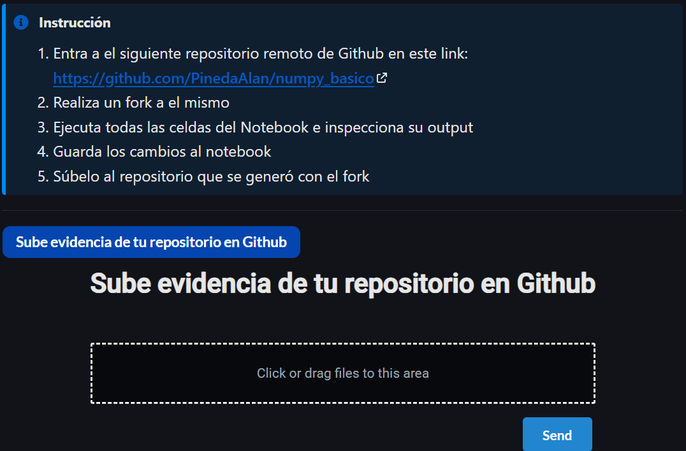

# numpy-basico

Instrucciones


## Que estoy haciendo?

### Instrucciones para entorno

1. fork del repo
2. Clonamos de actual
3. `git remote -v` para confirmar que esta apuntando a nuestro gitHub
4. Crear entorno virtual
   1. EN MI CASO: `/usr/bin/python3.12 -m venv .venv`
   2. source .venv/bin/activate
   3. `python --version` y `which python` para confirmar el entorno
5. Instalar dependencias
   1. `pip install -r requirements.txt`
6. Ya tiene `.gitignore` así que todo chill con eso
   1. Aun así buscalo y al principio agrega `.vscode` solo falto eso.
7. `pip install --upgrade pip` recomendado no obligatorio

### Instrucciones de actividad

1. `jupyter lab` abrimos jupyter lab
2. Ejecuta todas las celdas:
   1. En el notebook:
   2. Menú Run
   3. Run All Cells
      - En mi caso tuve que modificar estas lineas porque no corria jupyter lab
      - En lugar de multiplicar una matriz manual de 1000 x 1000 sera de 200 x 200.
      - Esto fuera de ser malo demuestra que python es lento.
      - Si sigues teniendo problemas puedes saltarte la multiplicación o dejar 1000 haber si se puede...
      - Tambien tuve que comentar algunas lineas porque daban error como `list + 2` o `list[:2, :2]`, checa bien que hace que este fallando tu nootebook

```python 
m_200 = generar_matriz_aleatoria(200)
start = time.time()
multiplicar_matrices(m_200, m_200)
end = time.time()
tiempo = end - start
print(f"Multiplicar dos matrices de 200x200 tardó {tiempo} seg.")
```

### Subit a repo (gitHub)

1. `git status` se debe ver el .ipynv modificado y lo que mas modificaste o agregaste.
2. `git add .` o `git add -A` si quieres asegurarte de guardar cada cambio en cualquier parte del proyecto.
3. `git commit -m "Ejecuta notebook, guarda outputs y modifico README.md con lo que hice"`
4. `git push origin main` sube los cambios a gitHub en la rama main (debimos haber creado otra rama y despues hacer merge pero ya x jaja)
